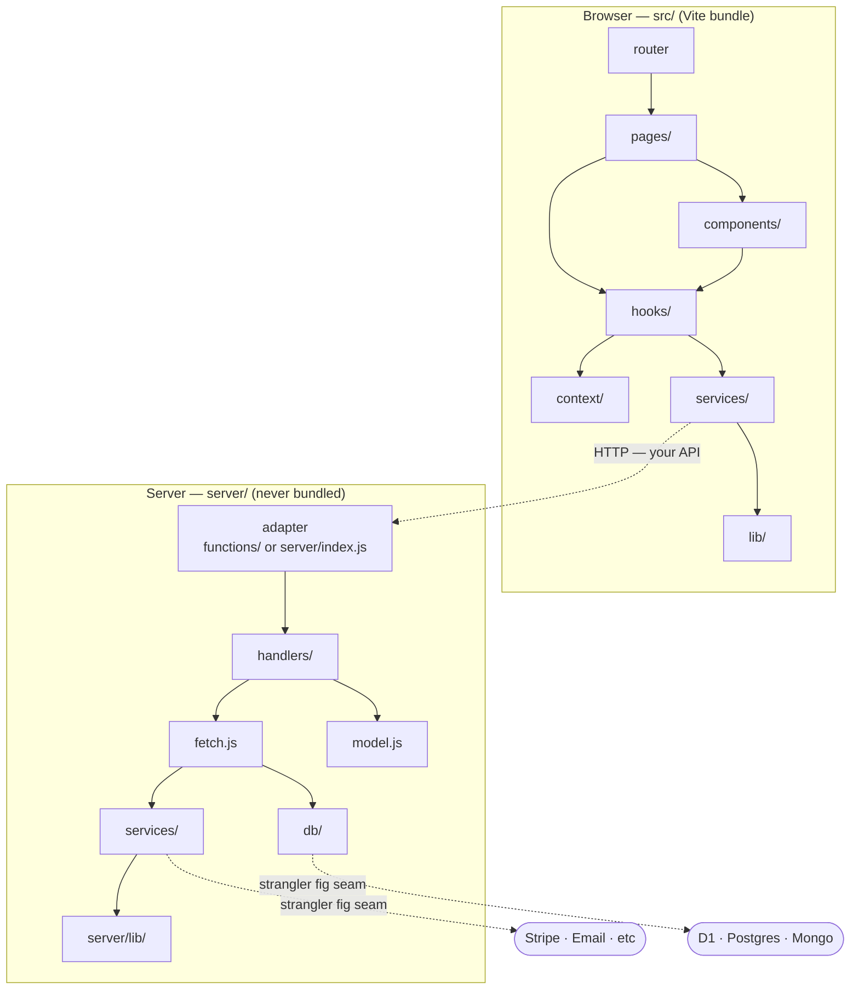

# Architecture

> Living document — update when layers change or responsibilities shift.

---

## Layer Diagram

---

## Layer Rules

Hard boundaries. Violating these creates debt that requires rewrites.

**src/ — browser only.** Nothing in `src/` may import from `server/`. Vite bundles `src/` — server code must never reach the browser.

**router** — defined in `app.jsx`. One route per page. Add nested routes for layouts.

**pages/** — routing and composition only. No fetch calls, no business logic. Extract logic to a hook.

**components/** — rendering only. Accept props, emit events via callbacks. Never call services directly.

**hooks/** — stateful logic that bridges components and services. One hook per concern.

**context/** — shared state that multiple components need. One context per domain. Consumed via a hook, never imported directly.

**services/** — browser-safe HTTP calls only. All go through `createClient`. Public env vars only (`VITE_` prefix).

**lib/** — browser HTTP infrastructure. `fetcher.js` and `createClient.js`. Zero domain knowledge.

---

**server/ — never imported by src/.** All server-side code lives here.

**handlers/** — one folder per resource. Each contains `handler.js`, `fetch.js`, `model.js`.

**handler.js** — entry and exit point. Pure functions returning `{ status, body }`. No runtime imports. Thin — calls fetch and model only.

**fetch.js** — all data access. Imports from `server/db` or `server/services`. Side effects live here and nowhere else.

**model.js** — pure transforms. No imports from db or services. Easily unit-tested with no mocks.

**server/services/** — server-only HTTP calls. Secret keys safe here. Same `createClient` pattern as `src/services/` but using `server/lib/fetcher`.

**server/db/** — DB interface. Implementation swapped per runtime. Never imported directly by handlers — always via `fetch.js`.

**server/lib/** — server HTTP infrastructure. Mirrors `src/lib/` but with server-appropriate timeout and logging.

---

## Adapter Layer

Adapters are the only runtime-specific code. They contain no logic — only wiring.

**CF Pages** — `functions/<resource>/[param].js`. Uses `onRequest*` exports and `Response.json()`.

**AWS ECS/Node** — `server/index.js`. Uses your chosen HTTP framework (Hono recommended). Registers all routes.

When you add a new route: write the handler once, wire it in both adapters. See [`docs/patterns.md`](patterns.md) for the full checklist.

---

## Strangler Fig Seam

The seam works at two levels:

1. **Provider swap** — replace Stripe with another payment provider: only `server/services/payments.js` changes.
2. **Runtime swap** — migrate from CF Pages to AWS ECS: only `functions/` adapters and `server/db/` implementation change. Handlers, hooks, and components are untouched.
