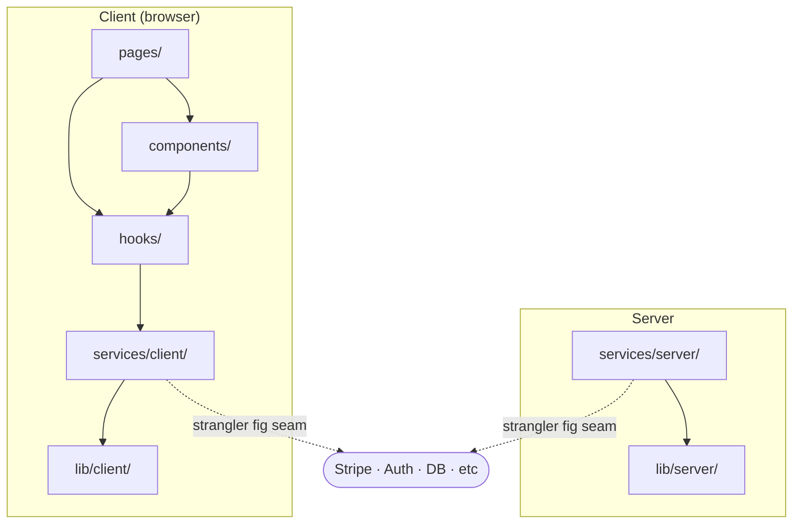

# Architecture

> Living document — update when layers change or responsibilities shift.

---

## Layer Diagram

---

## Layer Rules

Hard boundaries. Violating these creates debt that requires rewrites.

**pages/** — routing and composition only. No fetch calls, no business logic. Extract logic to a hook.

**components/** — rendering only. Accept props, emit events via callbacks. Never call services directly.

**hooks/** — stateful logic that bridges components and services. One hook per concern.

**services/** — the strangler fig seam. All external dependencies live here. App code never imports third-party libraries directly. Always through a service.

**lib/** — pure infrastructure. Fetcher and createClient have zero domain knowledge.

**utils/** — pure functions only. No imports from services, hooks, or components.
